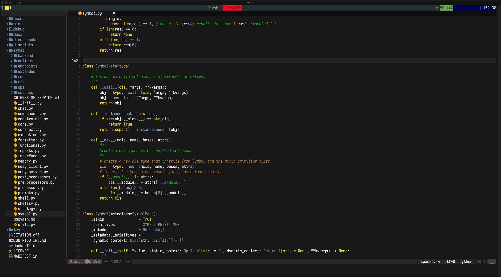

    

# What I use:

## General
- editor: [Neovim](https://neovim.io/)
- shell: [zsh](https://www.zsh.org/https://www.zsh.org/) + [oh-my-zsh](https://github.com/ohmyzsh/ohmyzsh)
- terminal: [xcfe4-term](https://docs.xfce.org/apps/terminal/start) on Linux, [iTerm2](https://iterm2.com/) on MacOS
- terminal multiplexer: [tmux](https://github.com/tmux/tmux)
- theme: [Gruber Darker](https://github.com/blazkowolf/gruber-darker.nvim)
- fonts: [losevkaTerm Nerd Font Light](https://github.com/ryanoasis/nerd-fonts/blob/master/patched-fonts/IosevkaTerm/IosevkaTermNerdFont-Light.ttf)
- version control: [Lazygit](https://github.com/jesseduffield/lazygit)
- pkg management: [brew](https://brew.sh/)

## Python
Currently, I'm using the following setup for Python development:
- [miniconda](https://docs.conda.io/en/latest/miniconda.html) for package management
- `jedi-language-server` ([link](https://github.com/pappasam/jedi-language-server)) for `goto definition` and `hover` functionality, and `ruff-lsp` ([link](https://github.com/astral-sh/ruff-lsp)) for `diagnostics` and `formatting`
- DAP for my debugger, with `nvim-dap-python` ([link](https://github.com/mfussenegger/nvim-dap-python)) as my Python adapter

# References:
- [Neovim doc](https://neovim.io/doc/)
- [tmux doc](https://github.com/tmux/tmux/wiki)
- [chrisatmachine](https://github.com/LunarVim/Neovim-from-scratch/tree/master)
- [fisadev](https://vim.fisadev.com/)
- [theprimeagen](https://github.com/ThePrimeagen/.dotfiles)

Thanks to all developers for their amazing work!
