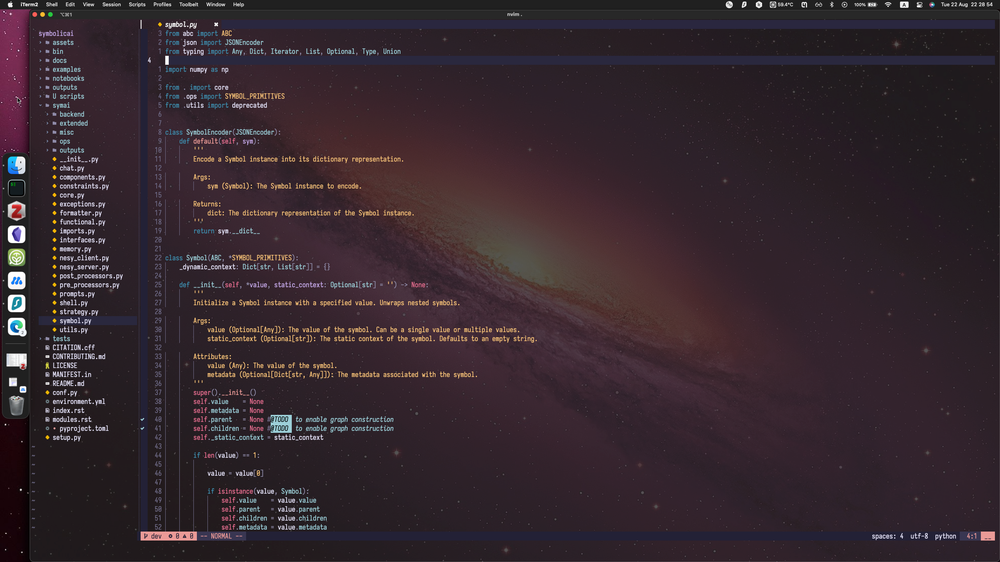
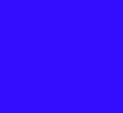

    

# What I use:

## General
- editor: [Neovim](https://neovim.io/)
- shell: [zsh](https://www.zsh.org/https://www.zsh.org/) + [oh-my-zsh](https://github.com/ohmyzsh/ohmyzsh)
- terminal: [xcfe4-term](https://docs.xfce.org/apps/terminal/start) on Linux, [iTerm2](https://iterm2.com/) on MacOS
- fonts: `Iosevka Nerd Font Mono Medium 16`
- palette:
    | Color   | Name                 | Hex       | Render                                                                                                              |
    |---------|----------------------|-----------|---------------------------------------------------------------------------------------------------------------------|
    | Black   | Raisin Black         | `#212121` | 
          
 |
    | White   | Cultured             | `#f5f5f5` | 
              
 |
    | Red     | Sweet Brown          | `#a93628` | 
           
 |
    | Green   | Green (Munsell)      | `#00a877` | 
       
 |
    | Yellow  | Deep Lemon           | `#f5c417` | 
            
 |
    | Blue    | Electric Ultramarine | `#3b0aff` | 
  
 |
    | Magenta | Jazzberry Jam        | `#a50b5e` | 
         
 |
    | Cyan    | Zomp                 | `#009698` | 
                  
 |

## Python
Currently, I'm using the following setup for Python development:
- [miniconda](https://docs.conda.io/en/latest/miniconda.html) for package management
- `jedi-language-server` ([link](https://github.com/pappasam/jedi-language-server)) for `goto definition` and `hover` functionality, and `ruff-lsp` ([link](https://github.com/astral-sh/ruff-lsp)) for `diagnostics` and `formatting`
- DAP for my debugger, with `nvim-dap-python` ([link](https://github.com/mfussenegger/nvim-dap-python)) as my Python adapter
- [Lazygit](https://github.com/jesseduffield/lazygit)

# References:
- [Neovim doc](https://neovim.io/doc/)
- [chrisatmachine](https://github.com/LunarVim/Neovim-from-scratch/tree/master)
- [fisadev](https://vim.fisadev.com/)
- [theprimeagen](https://github.com/ThePrimeagen/.dotfiles)

Thanks to all developers for their amazing work!
