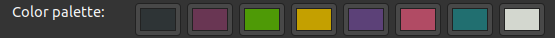

# What I use:

## General
- editor: [Neovim](https://neovim.io/)
- shell: [zsh](https://www.zsh.org/https://www.zsh.org/) + [oh-my-zsh](https://github.com/ohmyzsh/ohmyzsh)
- colorscheme: custom; load it on your Linux machine with:
```shell
dconf load /org/gnome/terminal/legacy/profiles:/ < /path/to/where/you/saved/your/gnome-terminal-profiles.dconf`
```
<p>
    
</p>

- fonts: `Iosevka Nerd Font Mono Regular 16`

## Python
Currently, I'm using the following setup for Python development:
- [miniconda](https://docs.conda.io/en/latest/miniconda.html) for package management
- `jedi-language-server` ([link](https://github.com/pappasam/jedi-language-server)) for `goto definition` and `hover` functionality, and `ruff-lsp` ([link](https://github.com/astral-sh/ruff-lsp)) for `diagnostics` and `formatting`
- DAP for my debugger, with `nvim-dap-python` ([link](https://github.com/mfussenegger/nvim-dap-python)) as my Python adapter
- [Lazygit](https://github.com/jesseduffield/lazygit)

# References:
- [chrisatmachine](https://github.com/LunarVim/Neovim-from-scratch/tree/master)
- [fisadev](https://vim.fisadev.com/)
- [theprimeagen](https://github.com/ThePrimeagen/.dotfiles)
