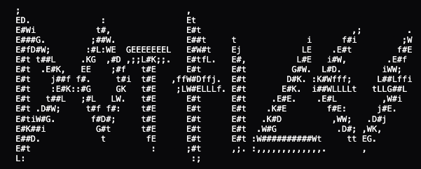

    

# What I use:

## General
- editor: [Zed](https://zed.dev/) + [neovim](https://neovim.io/)
- shell: [zsh](https://www.zsh.org/https://www.zsh.org/) + [oh-my-zsh](https://github.com/ohmyzsh/ohmyzsh)
- terminal: [ghostty](https://ghostty.org/)
- terminal multiplexer: [tmux](https://github.com/tmux/tmux)
- theme: [Gruvbox Dark Hard](https://github.com/morhetz/gruvbox)
- fonts: [Berkeley Mono v2](https://reidburke.com/updates/2024/12/berkeley-mono-v2/)
- version control: [Lazygit](https://github.com/jesseduffield/lazygit)
- pkg management: [brew](https://brew.sh/)

Also, because I could not find a buyer for my i9 MacBook Pro, I thought it would be a great idea for it to run [Omarchy](https://omarchy.org/).

## Python
Currently, I'm using the following setup for Python development:
- [uv](https://docs.astral.sh/uv/guides/install-python/)
- pyright
- I don't use formatting tools other than `isort` for sorting imports
- My debugger is `breakpoint` and `print` and very rarely the built-in IDE's functionality

Thanks to all developers for their amazing work!
